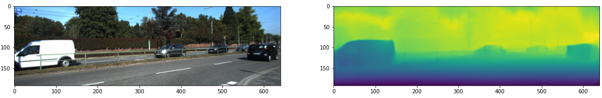

# Pydnet-Pytorch

Model optimizations and model conversions jupyter notebook 

Implements [PydNet](https://github.com/mattpoggi/pydnet) and [mobilePydnet](https://github.com/FilippoAleotti/mobilePydnet) in Pytorch.
    
For mobilePydnet , use `mobile_version = True`

Pretrained models trained on KITTI data at 192x640 resolution with [monodepth2](https://github.com/zshn25/monodepth2) are available below

[mobile_pydnet](https://github.com/zshn25/Pydnet-Pytorch/releases/download/v1.0/mobile_pydnet.pth)

The Pytorch model was also converted to ONNX and TensorFlow Lite. Check the corresponding release for the converted models. To learn how the conversion is done, check [this notebook](./inference.ipynb).

References:
1. [Towards real-time unsupervised monocular depth estimation on CPU](https://arxiv.org/abs/1806.11430), IROS 2018
2. [Real-time single image depth perception in the wild with handheld devices](https://arxiv.org/abs/2006.05724), Arxiv
